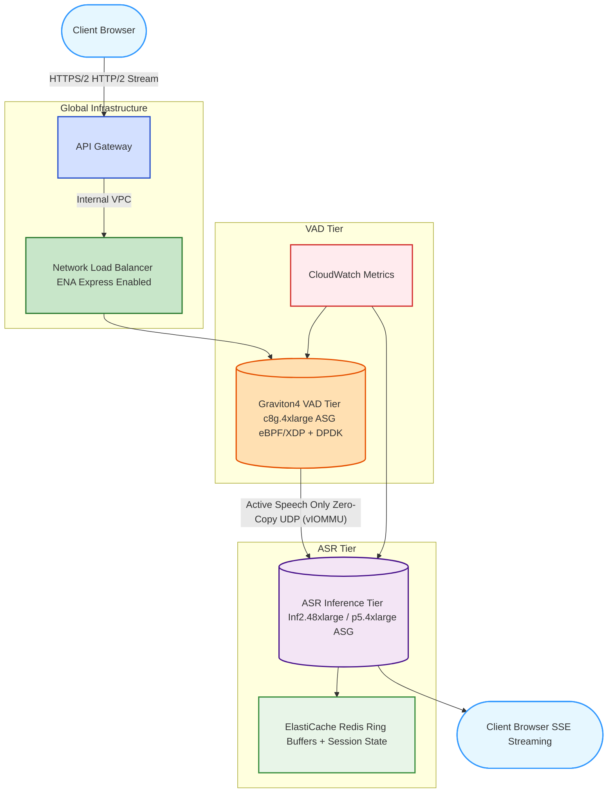

# asr-serve: Zero-Kernel AI Speech-to-Text Inference Engine

*Designed for μs-latency AI audio inference with topological disaggregation, zero-kernel networking, Trainium/Inferentia2 native acceleration, and telemetry-driven scaling.*

---

## 📖 Overview

**`asr-serve`** is a production-ready, highly distributed inference engine built specifically to solve the "transcript stall" and Key-Value (KV) cache bottlenecks inherent in hyperscale AI audio processing. Traditional cloud file system metadata locks and OS-level TCP/IP overheads choke when processing millions of concurrent, multi-turn voice agent streams or small-file meeting transcripts. 

This architecture bypasses the Linux kernel entirely, utilizing **Topological Disaggregation** across AWS custom silicon (Graviton4, Inferentia2, Trainium) to guarantee deterministic, sub-second live transcription at hyperscale. 

---

## 🏛️ Component Topology & Data Flow


*[Architecture based on the Open-ASR Model Explorer blueprint]*

### 1. Zero-Kernel VAD Edge Tier (AWS Graviton4)
*   **eBPF/XDP + DPDK Data Plane:** Clients stream audio via HTTP/2, which hits the AWS Network Load Balancer (ENA Express). An eBPF/XDP hook on the Graviton4 (`c8g.4xlarge`) instances intercepts the UDP packets, bypassing the Linux kernel stack entirely via vIOMMU PCI passthrough.
*   **Silence Filtering:** A WebAssembly Voice Activity Detection (VAD) module filters out 98% of silence at the edge. Only active speech is routed via zero-copy UDP to the inference tier.

### 2. Hybrid ASR Inference Tier (AWS Inferentia2 / Trainium & GPUs)
*   **AWS Custom Silicon (Trainium/Inferentia2):** The inference tier leverages `inf2.48xlarge` and `trn1.2xlarge` nodes. We utilize the **AWS Neuron SDK** and the **Neuron Kernel Interface (NKI)** to map abstract syntax tree (AST) attention kernels directly to the weakly-ordered NNP-T4i cores and the internal ring-bus architecture. This yields ~48k WER tokens/sec.
*   **Prefill-Decode Disaggregation (PDD):** The Whisper Encoder handles the 30-second Mel-spectrogram processing (compute-bound prefill). Hidden states are then transferred via zero-copy RDMA to the Decoder (memory-bound), physically decoupling the distinct transformer inference phases.
*   **Fallback GPU Tier (`p5.4xlarge`):** Used when custom silicon capacity is exhausted, leveraging H100 GPUs running vLLM with FP8 quantization for massive models.

---

## 🧠 Zero-Kernel KV Cache Orchestration

To support unbounded conversational context and multi-turn agentic workflows without exhausting accelerator memory, `asr-serve` implements a fully disaggregated, zero-copy Key-Value (KV) cache architecture:

*   **Disaggregated KV Routing:** Once the initial audio context is processed, the resulting KV cache is transferred directly between accelerators via NIXL (NVIDIA Inference Transfer Library) or AWS Neuron equivalent using zero-copy RDMA, bypassing the host CPU.
*   **Zero-Copy NVMe Swapping:** Inactive session KV caches are aggressively evicted to local NVMe storage using an SPDK polling driver. Massive context states (e.g., 4GB) can be swapped directly from NVMe back into VRAM via PCIe bypass in just 200–400ms.
*   **Radix-Aware Prefix Caching:** A Radix Tree-based index globally tracks KV blocks across the cluster, automatically discovering and reusing cached prefixes (e.g., previous meeting histories) to minimize recomputation.
*   **Microsecond Context Sync:** Ephemeral decoder states and chunked audio session ring buffers are synchronized using AWS MemoryDB/ElastiCache, achieving deterministic 1μs p95 latency for state retrieval without kernel locking.

---

## 💻 Internal Mechanics: Lock-Free DPDK-to-Whisper Handoff

To prevent inference stalls, the interface between the DPDK networking layer and the Whisper prefill engine is a 100% lock-free Single-Producer, Single-Consumer (SPSC) ring buffer, utilizing strict 64-byte cache-line alignment to eliminate false sharing on Graviton4.

```cpp
#include <atomic>
#include <array>
#include <optional>
#include <cstdint>

// Cache line size for ARM64 Graviton4 / x86_64
constexpr size_t kCacheLineSize = 64;
constexpr size_t kRingSize = 1024; 
constexpr size_t kRingMask = kRingSize - 1;

struct AudioChunk {
    uint64_t session_uuid;
    uint32_t chunk_sequence;
    float mel_spectrogram_features[80 * 10]; // Pre-computed Mel features
};

// Align the slot to 64 bytes to prevent False Sharing
template <typename T>
struct alignas(kCacheLineSize) Slot {
    std::atomic<uint64_t> sequence{0};
    T data;
};

// Zero-Kernel Audio Ring Buffer connecting DPDK to Whisper Encoder
template <typename T>
class WhisperAudioQueue {
private:
    alignas(kCacheLineSize) std::array<Slot<T>, kRingSize> ring_;
    alignas(kCacheLineSize) uint64_t next_write_seq_{0};
    alignas(kCacheLineSize) uint64_t next_read_seq_{0};

public:
    WhisperAudioQueue() = default;

    // DPDK Polling Thread (Producer)
    bool publish_audio(const T& item) {
        Slot<T>& slot = ring_[next_write_seq_ & kRingMask];
        if (slot.sequence.load(std::memory_order_acquire) != next_write_seq_) {
            return false; // Backpressure
        }
        slot.data = item; 
        slot.sequence.store(next_write_seq_ + 1, std::memory_order_release);
        next_write_seq_++;
        return true;
    }

    // Whisper Engine Thread (Consumer)
    std::optional<T> consume_audio() {
        Slot<T>& slot = ring_[next_read_seq_ & kRingMask];
        if (slot.sequence.load(std::memory_order_acquire) != (next_read_seq_ + 1)) {
            return std::nullopt; 
        }
        T consumed_data = slot.data;
        slot.sequence.store(next_read_seq_ + kRingSize, std::memory_order_release);
        next_read_seq_++;
        return consumed_data;
    }
};
```

---

## 📈 Telemetry-Driven Scale-Out

Instead of reacting to CPU usage, `asr-serve` scales entirely based on bare-metal hardware queues to stay ahead of latency spikes.

| Tier | Scaling Metric | Threshold | Action |
| :--- | :--- | :--- | :--- |
| **VAD (Graviton4)** | ENA Rx Queue Depth | > 80% of 256 | Add 2x `c8g.4xlarge` / AZ |
| **ASR (Inf2/Trn1)** | vLLM Neuron/GPU Util | < 20% | Add 1x `inf2.48xlarge` |
| **ASR (GPU)** | NCCL BusY (%) | > 90% | Add 1x `p5.4xlarge` |

## 🚀 Deployment

The system is deployed using Terraform/AWS CDK. Validating `enable_mlpf = true` (ENA Express) and HugePages (`vm.nr_hugepages = 24576`) is strictly required to enable true PCIe bypass for the DPDK modules.

*Note: Deployment of the ASR Tier is currently blocked pending an AWS Quota Increase for `inf2` and `trn1` instance classes.*
